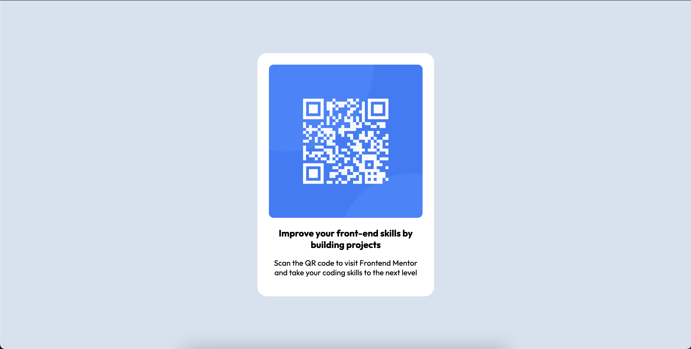

# Frontend Mentor - QR code component solution

This is a solution to the [QR code component challenge on Frontend Mentor](https://www.frontendmentor.io/challenges/qr-code-component-iux_sIO_H). Frontend Mentor challenges help you improve your coding skills by building realistic projects. 

## Table of contents

- [Overview](#overview)
  - [Screenshot](#screenshot)
  - [Links](#links)
- [My process](#my-process)
  - [Built with](#built-with)
  - [What I learned](#what-i-learned)
- [Author](#author)

## Overview

### Screenshot

### Links

- Solution URL: [link](https://www.frontendmentor.io/solutions/mobile-first-qr-code-display-using-flexbox-pHG5bGoj6D)
- Live Site URL: [link](https://visheshdvivedi.github.io/Frontend-Mentor-Challenge---QR-code/)

## My process

### Built with

- Semantic HTML5 markup
- CSS custom properties
- Flexbox
- Mobile-first workflow

### What I learned

I used this project to brush up my basic HTML and CSS skills. This project helped me brush up basics of flexbox, media queries and semantic HTML

## Author

- Frontend Mentor - [@visheshdvivedi](https://www.frontendmentor.io/profile/visheshdvivedi)